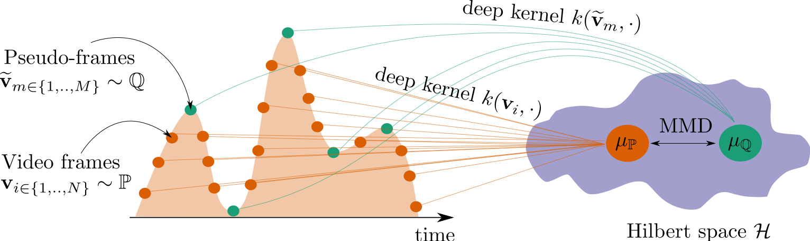

# Deep kernel video approximation for unsupervised action segmentation
Python implementation of the experiments from **"Deep kernel video approximation for unsupervised action segmentation"**, __Pintea, Silvia L and and Dijkstra, Jouke__.
[<a href="https://arxiv.org/abs/?">Arxiv</a>]


### Overview
We segment videos by learning in deep kernel space, to approximate the underlying frame distribution, as closely as possible.
To define this closeness metric between the original video distribution and its approximation, we rely on maximum mean discrepancy (MMD)
which is a geometry-preserving metric in distribution space, and thus gives more reliable estimates.
Moreover, unlike the commonly used optimal transport metric, MMD is both easier to optimize, and faster.
We choose to use neural tangent kernels (NTKs) to define the kernel space where MMD operates, because of their improved descriptive power as opposed to fixed kernels.
And, also, because NTKs sidestep the trivial solution, when jointly learning the inputs (video approximation) and the kernel function.



Finally, we show competitive results when compared to state-of-the-art per-video methods, on six standard benchmarks.
Additionally, our method has higher F1 scores than prior agglomerative work, when the number of segments is unknown.


### Requirements and third party code:

- See ```<requirements.txt>``` for a complete list.

- Docker container from: https://github.com/yurivwarmerdam/docker_example of Yuri van Warmerdam
- TW-Finch baseline from: https://github.com/ssarfraz/FINCH-Clustering/ of Saquib Sarfraz et al.
- Our MMD segmentation code is inspired from: https://colab.research.google.com/github/google-research/google-research/blob/master/kip/KIP.ipynb of Timothy Nguyen et al (authors' license included).

To run the docker container just type:
```
> bash run.sh
```

**All credit for third party software/code is with the authors.**

### Code organization

All code is in ```ext_files/```.

#### Utilities:

```
utils/              -- directory containing auxiliary functions
    /bf_video.py    -- class for reading "Breakfast" features
    /da_video.py    -- class for reading "Desktop Assembly" features
    /fs_video.py    -- class for reading "50 Salads" features
    /he_video.py    -- class for reading "Hollywood Extended" features
    /mp2_video.py   -- class for reading "MPII Cooking" features
    /yti_video.py   -- class for reading "YouTube Instructions" features
    /mnist_video.py -- class for reading our "Moving5" raw videos (created from MNIST digits)
```

### Dataset classes:

```
datasets/           -- directory containing dataset classes
    /auxiliary.py   -- containing functions for data reading, smoothing, visualizations, and score aggregation
    /eval_script.py -- adjusted code from https://github.com/ssarfraz/FINCH-Clustering/ for evaluation
```

Put all the dataset files in the ```data/``` folder.

#### Baseline code:

To use the code, you first need to link the ```data/```, ```utils/``` and ```datasets/``` directories to ```baseline/```.

The code contains:

```
baseline/      -- directory with baseline implementations
    demo.py    -- main code running a selecting baseline on a selected dataset
    twfinch.py -- official implementation of [1]
    abd.py     -- unofficial implementation of [2] (fails to replicate results)
    sam.py     -- unofficial implementation of [3] (fails to replicate results)
```

[1] __Sarfraz, Saquib, et al.__ **"Temporally-weighted hierarchical clustering for unsupervised action segmentation"**, CVPR, 2021.

[2] __Du, Zexing, et al.__ **"Fast and unsupervised action boundary detection for action segmentation", CVPR, 2022.

[3] __Xing, Zheng, and Weibing Zhao__. **"Unsupervised action segmentation via fast learning of semantically consistent actoms"**, AAAI, 2024.

To run the TW-FINCH baseline model on the "50 Salads" dataset, for example, just run:

```
> cd ext_files/baseline/
> python demo.py --run twfinch --dataset fs
```

#### Deep kernel video approximation code:

To use the code, you first need to link the ```data/```, ```utils/``` and ```datasets/``` directories to ```seg_mmd/```.

The code contains:

```
mmd_lib/               -- directory containing our video approximation implementation
    demo_mmd.py        -- main code running a certain configuration of our code on a selected dataset
    mmd/               -- directory containing all the source code
        mmd.py         -- defines the model updates and the MMD loss on top of different kernel functions (the code extends the code from [4])
        kernel.py      -- defines the kernel function as an NTK over an MLP (the code extends the code from [4])
        preparation.py -- data standardization and batch splitting (the code extends the code from [4])
        train.py       -- implementation of the main training and inference loops.
```

[4] __Nguyen, Timothy, et. al.__ **"Dataset meta-learning from kernel ridge-regression"**, ICLR, 2021.

(https://colab.research.google.com/github/google-research/google-research/blob/master/kip/KIP.ipynb)


To run our code on the "50 Salads" dataset, for example, just run:

```
> cd ext_files/mmd_lib/
> python demo_mmd.py --dataset "fs" --kernel "combi" --figpath "./results/fs" --smooth 2.5
```

To aggregate the scores over all the videos in "50 Salads", run:

```
> cd ext_files/utils/
> python auxsiliry "./results/fs"
```

### Data sources:

We use previously provided features for each dataset:

- "Breakfast" features from <a href="https://github.com/Annusha/unsup_temp_embed/blob/master/HOWTO_master.md">link</a> in [5]
- "Desktop Assembly" features from <a href="https://github.com/trquhuytin/TOT-CVPR22">link</a> in [6]
- "50 Salads" features from <a href="https://github.com/Annusha/unsup_temp_embed/blob/master/HOWTO_master.md">link</a> in [5]
- "Hollywood Extended" features from <a href="# https://github.com/ssarfraz/FINCH-Clustering/tree/master/TW-FINCH">linl</a> in [1]
- "MPII Cooking" features from <a href="# https://github.com/ssarfraz/FINCH-Clustering/tree/master/TW-FINCH">linl</a> in [1]
- "YouTube Instructions" features from <a href="https://github.com/Annusha/unsup_temp_embed/blob/master/HOWTO_master.md">link</a> in [5]
- "Moving5" the raw data and labes written as a pickle <a href="https://www.dropbox.com/scl/fo/a2qjct1nw3ak7usy72ygn/ANQ4vUFEfvaDSSMJFM18UPU?rlkey=9env2btavd6dns05bst7hfpf2&st=p0m49hmr&dl=0">link</a>


[5] __Kukleva, Anna, et al.__ **"Unsupervised learning of action classes with continuous temporal embedding"**, CVPR, 2019.

[6] __Kumar, Sateesh, et al.__ **"Unsupervised action segmentation by joint representation learning and online clustering"**, CVPR, 2022.

**All credit for data features is with the authors.**

Create a ```data/``` folder contining the dataset files.

The datasets should contain the all the same structure except for "Moving5":

```
data/                    -- the folder with all the data files
    50Salads/           -- folder contains the "50 Salads" dataset
        features/       -- text files contains features vectors, 1 file per video, 1 row per frame
        groundTruth/    -- text files containing action labels, 1 file per video, 1 row per frame
        mapping/
            mapping.txt -- containg the class mapping to 0-K numbers
    Breakfast           -- containing the "Breakfast" dataset
        ...
    DesktopAssemble     -- containing the "Dekstop Assembly" dataset
        ...
    HollywoodExtended   -- containing the "Hollywood Extended" dataset
        ...
    MPIICooking         -- containing the "MPII Cooking" dataset
        ...
    YouTubeInstructions -- containing the "YouTube Instructions" dataset
        ...
    Moving5/             -- containing the "Moving5" raw data
        mnist100.pkl   -- containing the pickled data: (data, labels) tuple pickled together.
```

### Citation

If you use this code, please cite the publication:


```
...
```
